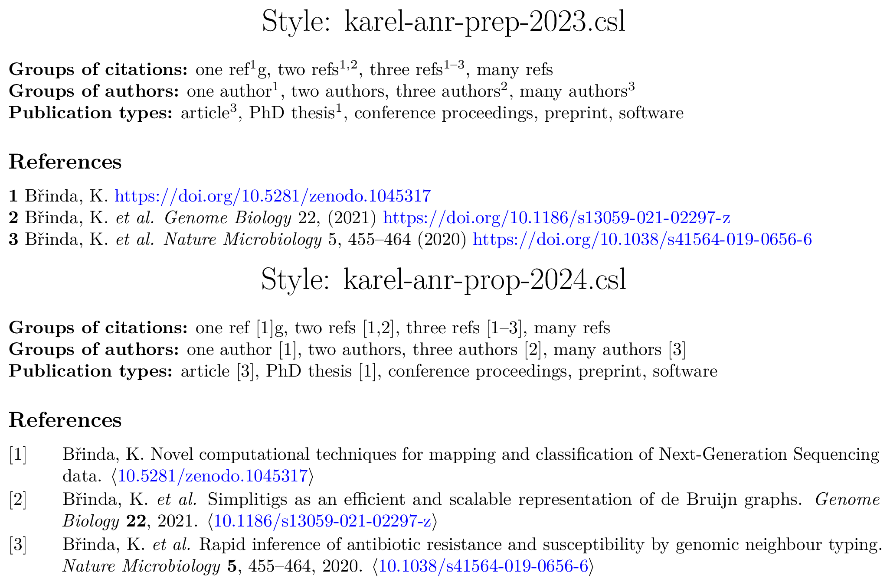

# Citation styles

<!-- vim-markdown-toc GFM -->

* [Introduction](#introduction)
* [Styles](#styles)
* [How to use](#how-to-use)
  * [Paperpile (Google Docs)](#paperpile-google-docs)
    * [Switching to a custom CSL](#switching-to-a-custom-csl)
    * [Exporting to PDF](#exporting-to-pdf)

<!-- vim-markdown-toc -->

## Introduction

In this repo, I put some personal CSL styles I use for papers and grant proposals with example outputs and comments related to how to use them in specific tools. All the files should be easily reusable.

## Styles

The repo currently contains two styles, `karel-anr-prep-2023.csl` based on the
[Minimal citation style for grant proposals](https://anton.cromba.ch/2016/02/07/a-minimal-citation-stylefor-grant-proposals) and `karel-anr-prop-2024.csl` based on the [Zotero Style Nature without superstript](http://www.zotero.org/styles/nature-no-superscript).

Here are example outputs:

## How to use

### Paperpile (Google Docs)

#### Switching to a custom CSL

1. Go to Extensions / Paperpile / Manage Citations / Open Paperpile (or directly open [paperpile.com/app](https://paperpile.com/app))
2. Go to xxx and remove the style of the same name (if exists)
3. Upload your CSL style
4. Go to your paper in Google Docs
5. Open Paperpile / Citation Style, select the name of the uploaded CSL style, and click on Update

#### Exporting to PDF

There are several different approaches.

* **Google Docs PDF.** First, remove Paperpile codes by "Extensions / Manage Paperpile / the gear icon / Export / No citation codes". Then, export you PDF via "File / Download / PDF".
* **Latex PDF.** First, convert the text to latex citations "Extensions / Manage Paperpile / the gear icon / Export / Bibtex citation codes". Then, copy your text to Latex and adjust it. Finally, download the bibtex file by "Paperpile / Export / References as Bibtex".
* **Microsoft Word PDF.** Useful when additional postprocessing needs to be done (style adjustion, manual finalization of the bibliography formatting, etc.). First, download your document as DOCX. Second, open it Microsoft Word (with Paperpile) and convert the bibliography to the DOCX style. Do all the manual finalization / postprocessing (e.g., turn individual refs as links to DOIs). Finally, export as a PDF.
